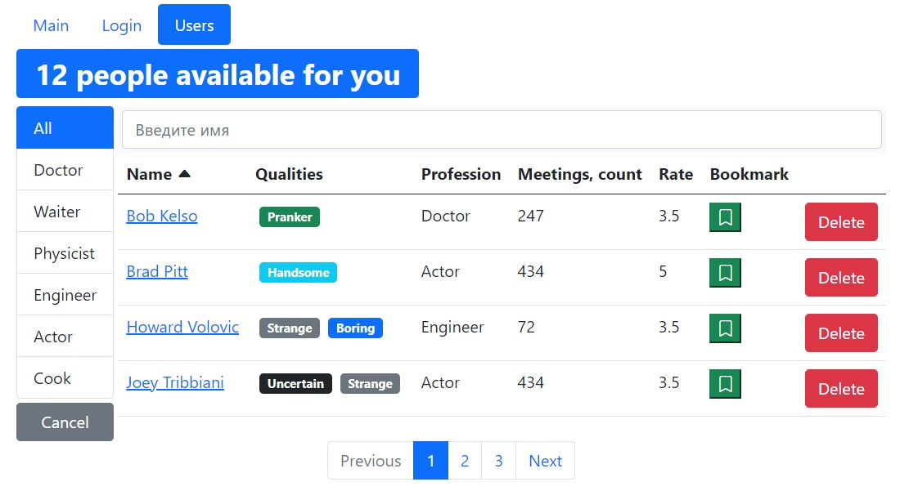

# React project for practice from front-end courses 2021

**Description**: a tutorial project from front-end courses,
includes working with states, redux, useContext, routing,
optimization hooks, custom hooks, authorization and registration,
pagination and working with forms, node.js, express, mongoDB, docker.
The goal of the project is to capture all the important aspects of React 
and bring the practice as close as possible to commercial development.
The closest similar apps are social networks

Login

Users list

User page

Config form (for change user data)

